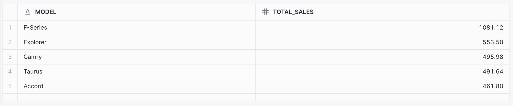
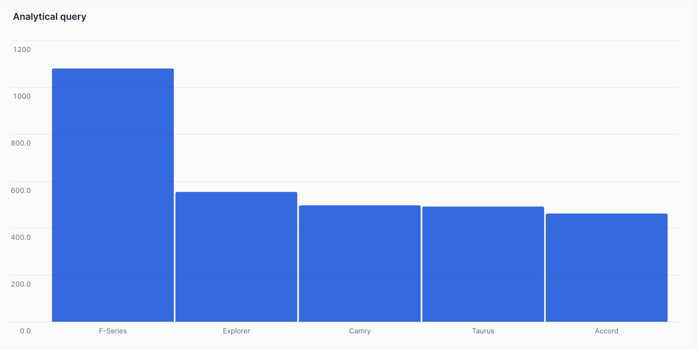
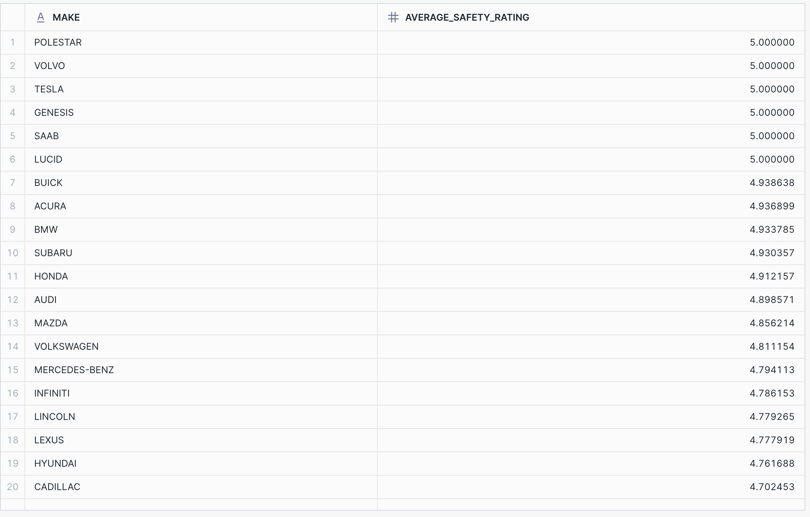
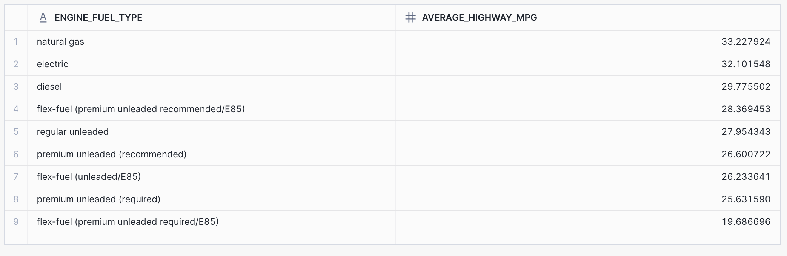
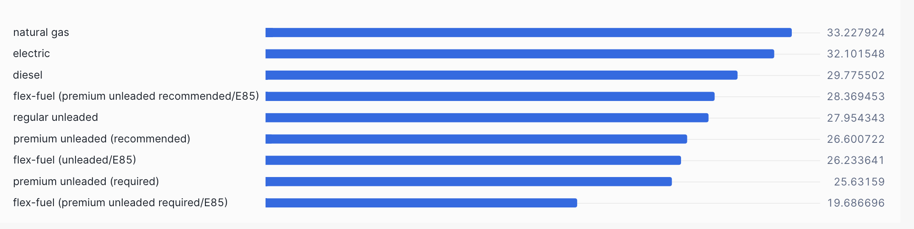
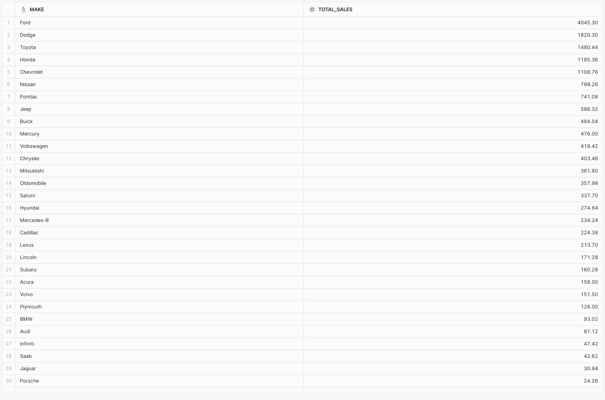
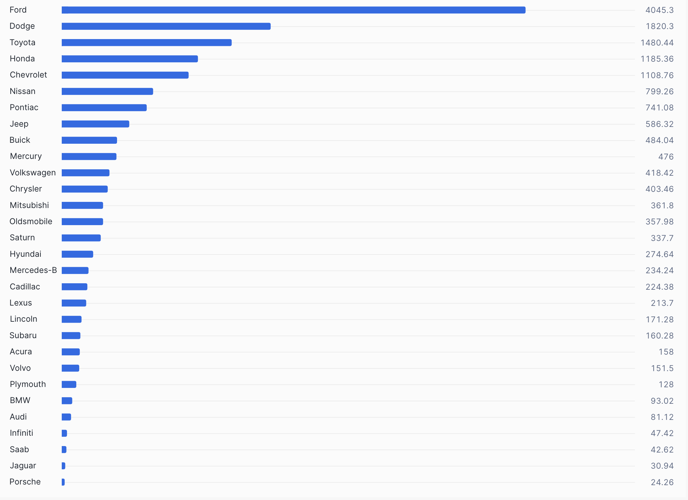
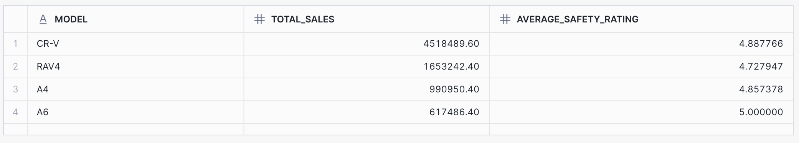
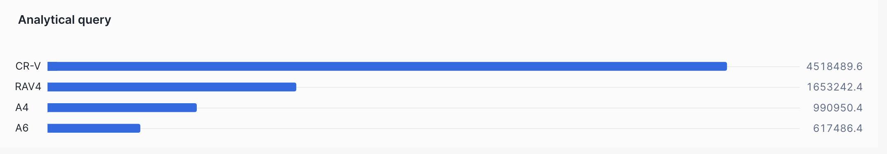

### ITMD-526 
## SUMMARY 

This project aims to build a data warehouse for car-related data, consolidating information from various sources to enable insightful analysis. We implemented a star/snowflake schema in Snowflake to facilitate efficient querying and reporting. Key findings include Top Car Models by Sales, Avg Safety Rating, Avg Highway MPG by engine fuel type, Total Sales by Car Make, Models with High Sales and High Safety Ratings, .    
The project demonstrates the advantages of dimensional modeling for analytical purposes.

## Project Structure

The project structure follows as 

CarDataWarehouse/   
├── data/   
├── sql/    
├── screenshots/    
├── README.md

Data - Contains the raw data files in CSV format.   
SQL -  Stores SQL scripts for table creation, ETL processes, and analytical queries.    
Screenshots -  Holds screenshots of query results, visualizations, and the snowflake schema diagram.    
README.md -  This document, providing project documentation and instructions.

## Data Sourcing

#### Data Sources:

[CAR_FEATURES_AND_PRICES Dataset](https://www.kaggle.com/datasets/rupindersinghrana/car-features-and-prices-dataset),

[CAR-SALES Dataset](https://www.kaggle.com/datasets/klu2000030172/car-sales-dataset)

[USED-CAR-SALES Dataset](https://www.kaggle.com/datasets/tsaustin/us-used-car-sales-data)

[Safer-Cars Dataset](https://data.transportation.gov/Automobiles/New-Car-Assessment-Program-NCAP-5-Star-Safety-Rati/jrw6-ye84/about_data)

Data Format: CSV

#### Data dictionary: 

#### CAR_FEATURES_AND_PRICES         
Row count - 11905       

| Column Name      | Description                               |
| :--------------- | :---------------------------------------- |
| MAKE             | Car manufacturer                          |
| MODEL            | Car model                                 |
| YEAR             | Year the car was manufactured             |
| MARKETCATEGORY   | Market category(ies) of the vehicle       |
| VEHICLESIZE      | Size of the vehicle                       |
| VEHICLESTYLE     | Style of the vehicle                      |
| HIGHWAYMPG       | Highway miles per gallon                  |
| CITYMPG          | City miles per gallon                     |
| POPULARITY       | Popularity rating of the vehicle          |
| MSRP             | Manufacturer's Suggested Retail Price    |
| ENGINEHP         | Engine horsepower                         |

#### CAR-SALES       
Row count - 157

| Column Name            | Description                               |
| :--------------------- | :---------------------------------------- |
| MAKE                   | Car manufacturer                          |
| MODEL                  | Car model                                 |
| SALESINTHOUSANDS       | Sales in thousands of units               |
| VEHICLETYPE            | Type of vehicle                           |
| LATESTLAUNCH           | Date of the latest vehicle launch         |
| YEARRESALEVALUE        | Year resale value                         |
| PRICEINTHOUSANDS       | Price in thousands                        |
| HORSEPOWER             | Horsepower of the vehicle                 |
| FUELCAPACITY           | Fuel capacity                             |
| FUELEFFICIENCY         | Fuel efficiency                           |
| POWERPERFORMANCEFACTOR | Power performance factor                  |
| ENGINESIZE             | Engine size                               |

#### USED-CAR-SALES
Row count - 10000

| Column Name      | Description                               |
| :--------------- | :---------------------------------------- |
| MAKE             | Car manufacturer                          |
| MODEL            | Car model                                 |
| YEAR             | Year the car was manufactured             |
| ENGINESIZE       | Engine size                               |
| FUELTYPE         | Fuel type of the vehicle                  |
| TRANSMISSION     | Type of transmission                      |
| MILEAGE          | Mileage of the vehicle                    |
| DOORS            | Number of doors                           |
| OWNERCOUNT       | Number of previous owners                 |
| PRICE            | Price of the used car                     |

#### Safer-Cars
Row count - 11736

| Column Name            | Description                                   |
| :--------------------- | :-------------------------------------------- |
| MAKE                   | Car manufacturer                              |
| MODEL                  | Car model                                     |
| MODELYR                | Model year                                    |
| BODYSTYLE              | Body style of the vehicle                     |
| VEHICLETYPE            | Type of vehicle                               |
| DRIVETRAIN             | Drive train of the vehicle                    |
| PRODUCTIONRELEASE      | Production release year                       |
| VEHICLECLASS           | Vehicle class                                 |
| BODYFRAME              | Body frame type                               |
| NUMOFSEATING           | Number of seating                             |
| FRNTTESTNO             | Front test number                             |
| FRNTVIN                | Front VIN number                              |
| FRNTDRIVSTARS          | Front driver star rating                      |
| FRNTPASSSTARS          | Front passenger star rating                   |
| OVERALLFRNTSTARS       | Overall front star rating                     |
| NETCOMPPASS            | Net composite passenger rating                |
| SIDEDRIVSTARS          | Side driver star rating                       |
| SIDEPASSSTARS          | Side passenger star rating                    |
| SIDEBARRIERSTARS       | Side barrier star rating                      |
| COMBFRNTSTARS          | Combined front star rating                    |
| COMBREARSTARS          | Combined rear star rating                     |
| OVERALLSIDESTARS       | Overall side star rating                      |
| ROLLOVERSTARS          | Rollover star rating                          |
| NHTSABACKUPCAMERA      | NHTSA backup camera availability              |
| BACKUPCAMERA           | Backup camera availability                    |
| NUMOFSEATING_NEW       | Number of seating (new format)                |
| OVERALLSTARS           | Overall star rating                           |

## ETL Implementation

#### Extraction:     
Data was manually staged into Snowflake using the Snowflake web interface. The CSV files were uploaded to internal stages associated with each respective table, ensuring the data was readily accessible for the COPY INTO commands.   

Data was then loaded from the internal stages into raw tables within the CARS_DATASET.PUBLIC schema using the COPY INTO command.


#### Transformation:     
#### Dimension Table Creation and Population:    
Dimension tables were created to store descriptive attributes, enhancing data analysis.    

CAR_MAKE_DIMENSION: 

```
CREATE TABLE CAR_MAKE_DIMENSION (
    MAKE_ID INT AUTOINCREMENT PRIMARY KEY,
    MAKE VARCHAR(255) UNIQUE NOT NULL
);
INSERT INTO CAR_MAKE_DIMENSION (MAKE)
SELECT DISTINCT MAKE FROM CAR_FEATURES_AND_PRICES
UNION
SELECT DISTINCT MAKE FROM CAR_SALES
UNION
SELECT DISTINCT MAKE FROM USED_CAR_PRICES
UNION
SELECT DISTINCT MAKE FROM SAFER_CARS_RATING;
```
This table stores unique car makes, using an auto-incrementing MAKE_ID as the primary key.

CAR_MODEL_DIMENSION: 
```
CREATE TABLE CAR_MODEL_DIMENSION (
    MODEL_ID INT AUTOINCREMENT PRIMARY KEY,
    MODEL VARCHAR(255) UNIQUE NOT NULL
);
INSERT INTO CAR_MODEL_DIMENSION (MODEL)
SELECT DISTINCT MODEL FROM CAR_FEATURES_AND_PRICES
UNION
SELECT DISTINCT MODEL FROM CAR_SALES
UNION
SELECT DISTINCT MODEL FROM USED_CAR_PRICES
UNION
SELECT DISTINCT MODEL FROM SAFER_CARS_RATING;
```
This table stores unique car models, using an auto-incrementing MODEL_ID as the primary key.

ENGINE_DIMENSION:    
```
CREATE TABLE ENGINE_DIMENSION (
    ENGINE_ID INT AUTOINCREMENT PRIMARY KEY,
    ENGINE_FUEL_TYPE VARCHAR(255),
    ENGINE_HP INT,
    ENGINE_CYLINDERS INT
);
INSERT INTO ENGINE_DIMENSION (ENGINE_FUEL_TYPE, ENGINE_HP, ENGINE_CYLINDERS)
SELECT DISTINCT
    ENGINEFUELTYPE,
    COALESCE(TRY_CAST(ENGINEHP AS NUMBER), 0),
    COALESCE(TRY_CAST(ENGINECYLINDERS AS NUMBER), 0)
FROM CAR_FEATURES_AND_PRICES;
```
This table stores engine information, handling potential null values and data type conversions using COALESCE and TRY_CAST.

TRANSMISSION_DIMENSION:  
```
CREATE TABLE TRANSMISSION_DIMENSION (
    TRANSMISSION_ID INT AUTOINCREMENT PRIMARY KEY,
    TRANSMISSION_TYPE VARCHAR(255)
);
INSERT INTO TRANSMISSION_DIMENSION (TRANSMISSION_TYPE)
SELECT DISTINCT TRANSMISSIONTYPE FROM CAR_FEATURES_AND_PRICES;
```
This table stores transmission types.

VEHICLE_DIMENSION:   
```
CREATE TABLE VEHICLE_DIMENSION (
    VEHICLE_ID INT AUTOINCREMENT PRIMARY KEY,
    DRIVEN_WHEELS VARCHAR(255),
    NUMBER_OF_DOORS INT,
    MARKET_CATEGORY VARCHAR(255),
    VEHICLE_SIZE VARCHAR(255),
    VEHICLE_STYLE VARCHAR(255)
);
INSERT INTO VEHICLE_DIMENSION (DRIVEN_WHEELS, NUMBER_OF_DOORS, MARKET_CATEGORY, VEHICLE_SIZE, VEHICLE_STYLE)
SELECT DISTINCT DRIVENWHEELS, NUMBEROFDOORS, MARKETCATEGORY, VEHICLESIZE, VEHICLESTYLE FROM CAR_FEATURES_AND_PRICES;
```
This table stores vehicle specific data.

SAFETY_RATING_DIMENSION:     
```
CREATE TABLE SAFETY_RATING_DIMENSION (
    SAFETY_ID INT AUTOINCREMENT PRIMARY KEY,
    OVERALL_STARS INT,
    FRONT_TEST_NO VARCHAR(255),
    FRONT_DRIVER_STARS INT,
    FRONT_PASSENGER_STARS INT,
    SIDE_DRIVER_STARS INT,
    SIDE_PASSENGER_STARS INT,
    SIDE_BARRIER_STARS INT,
    ROLLOVER_STARS INT,
    BACKUP_CAMERA VARCHAR(255)
);
INSERT INTO SAFETY_RATING_DIMENSION (
    OVERALL_STARS, FRONT_TEST_NO, FRONT_DRIVER_STARS, FRONT_PASSENGER_STARS,
    SIDE_DRIVER_STARS, SIDE_PASSENGER_STARS, SIDE_BARRIER_STARS,
    ROLLOVER_STARS, BACKUP_CAMERA
)
SELECT DISTINCT
    COALESCE(TRY_CAST(OVERALLSTARS AS NUMBER), 0),
    COALESCE(FRNTTESTNO, 'Unknown'),
    COALESCE(TRY_CAST(FRNTDRIVSTARS AS NUMBER), 0),
    COALESCE(TRY_CAST(FRNTPASSSTARS AS NUMBER), 0),
    COALESCE(TRY_CAST(SIDEDRIVSTARS AS NUMBER), 0),
    COALESCE(TRY_CAST(SIDEPASSSTARS AS NUMBER), 0),
    COALESCE(TRY_CAST(SIDEBARRIERSTARS AS NUMBER), 0),
    COALESCE(TRY_CAST(ROLLOVERSTARS AS NUMBER), 0),
    COALESCE(BACKUPCAMERA, 'Unknown')
FROM SAFER_CARS_RATING;
```
This table stores safety rating data.

MARKET_CATEGORY_DIMENSION:  
```
CREATE TABLE MARKET_CATEGORY_DIMENSION (
    MARKET_CATEGORY_ID NUMBER(38,0) PRIMARY KEY AUTOINCREMENT,
    CATEGORY_NAME VARCHAR(255) UNIQUE NOT NULL
);
INSERT INTO MARKET_CATEGORY_DIMENSION (CATEGORY_NAME)
SELECT DISTINCT TRIM(value)
FROM CAR_FEATURES_AND_PRICES, LATERAL FLATTEN(input => SPLIT(MARKETCATEGORY, ','));
```
This table stores market categories, using LATERAL FLATTEN to handle comma-separated values. 

FUEL_DIMENSION:
```
CREATE TABLE FUEL_DIMENSION (
    FUEL_ID NUMBER(38,0) PRIMARY KEY AUTOINCREMENT,
    FUEL_TYPE VARCHAR(255) UNIQUE NOT NULL
);
INSERT INTO FUEL_DIMENSION (FUEL_TYPE)
SELECT DISTINCT FUELTYPE FROM USED_CAR_PRICES
UNION
SELECT DISTINCT ENGINEFUELTYPE FROM CAR_FEATURES_AND_PRICES;
```       
This table stores fuel types.

#### Fact Table Creation and Population:   

Fact tables were created to store measures and connect to dimension tables using surrogate keys.


CAR_FEATURES_FACT:
```
CREATE TABLE CAR_FEATURES_FACT (
    CAR_ID INT AUTOINCREMENT PRIMARY KEY,
    MAKE_ID INT,
    MODEL_ID INT,
    YEAR INT,
    ENGINE_ID INT,
    TRANSMISSION_ID INT,
    VEHICLE_ID INT,
    HIGHWAY_MPG INT,
    CITY_MPG INT,
    POPULARITY INT,
    MSRP DECIMAL(10,2),
    CONSTRAINT FK_CAR_MAKE FOREIGN KEY (MAKE_ID) REFERENCES CAR_MAKE_DIMENSION(MAKE_ID),
    CONSTRAINT FK_CAR_MODEL FOREIGN KEY (MODEL_ID) REFERENCES CAR_MODEL_DIMENSION(MODEL_ID),
    CONSTRAINT FK_ENGINE FOREIGN KEY (ENGINE_ID) REFERENCES ENGINE_DIMENSION(ENGINE_ID),
    CONSTRAINT FK_TRANSMISSION FOREIGN KEY (TRANSMISSION_ID) REFERENCES TRANSMISSION_DIMENSION(TRANSMISSION_ID),
    CONSTRAINT FK_VEHICLE FOREIGN KEY (VEHICLE_ID) REFERENCES VEHICLE_DIMENSION(VEHICLE_ID)
);

INSERT INTO CAR_FEATURES_FACT (
    MAKE_ID,
    MODEL_ID,
    YEAR,
    ENGINE_ID,
    VEHICLE_ID,
    HIGHWAY_MPG,
    CITY_MPG,
    POPULARITY,
    MSRP
)
SELECT
    m.MAKE_ID,
    mo.MODEL_ID,
    cf.YEAR,
    e.ENGINE_ID,
    v.VEHICLE_ID,
    cf.HIGHWAYMPG,
    cf.CITYMPG,
    cf.POPULARITY,
    cf.MSRP
FROM
    CAR_FEATURES_AND_PRICES cf
JOIN
    CAR_MAKE_DIMENSION m ON cf.MAKE = m.MAKE
JOIN
    CAR_MODEL_DIMENSION mo ON cf.MODEL = mo.MODEL
LEFT JOIN
    ENGINE_DIMENSION e ON cf.ENGINEHP = e.ENGINE_HP
LEFT JOIN
    VEHICLE_DIMENSION v ON cf.VEHICLESIZE = v.VEHICLE_SIZE
    AND cf.VEHICLESTYLE = v.VEHICLE_STYLE;

```

This table links car features to dimensions, using surrogate keys for MAKE_ID, MODEL_ID, ENGINE_ID, and VEHICLE_ID. The JOIN clauses retrieve the corresponding surrogate keys from the dimension tables. 


CAR_SALES_FACT:
```
CREATE TABLE CAR_SALES_FACT (
    SALES_ID INT AUTOINCREMENT PRIMARY KEY,
    MAKE_ID INT,
    MODEL_ID INT,
    SALES_IN_THOUSANDS DECIMAL(10,2),
    YEARRESALEVALUE NUMBER(38,2),
    PRICE_IN_THOUSANDS DECIMAL(10,2),
    ENGINE_SIZE DECIMAL(10,2),
    HORSEPOWER INT,
    FUEL_CAPACITY DECIMAL(10,2),
    FUEL_EFFICIENCY DECIMAL(10,2),
    LATEST_LAUNCH DATE,
    POWER_PERFORMANCE_FACTOR VARCHAR(255),
    CONSTRAINT FK_CAR_MAKE FOREIGN KEY (MAKE_ID) REFERENCES CAR_MAKE_DIMENSION(MAKE_ID),
    CONSTRAINT FK_CAR_MODEL FOREIGN KEY (MODEL_ID) REFERENCES CAR_MODEL_DIMENSION(MODEL_ID)
);

INSERT INTO CAR_SALES_FACT (MAKE_ID, MODEL_ID, SALES_IN_THOUSANDS, YEARRESALEVALUE, PRICE_IN_THOUSANDS, HORSEPOWER, FUEL_CAPACITY, FUEL_EFFICIENCY, LATEST_LAUNCH, POWER_PERFORMANCE_FACTOR)
SELECT
    m.MAKE_ID,
    mo.MODEL_ID,
    cs.SALESINTHOUSANDS,
    cs.YEARRESALEVALUE,
    cs.PRICEINTHOUSANDS,
    cs.HORSEPOWER,
    cs.FUELCAPACITY,
    cs.FUELEFFICIENCY,
    cs.LATESTLAUNCH,
    cs.POWERPERFORMANCEFACTOR
FROM CAR_SALES cs
JOIN CAR_MAKE_DIMENSION m ON cs.MAKE = m.MAKE
JOIN CAR_MODEL_DIMENSION mo ON cs.MODEL = mo.MODEL;
```
This table links car sale information to the car make and model dimension tables.

USED_CAR_PRICES_FACT:

```
CREATE TABLE USED_CAR_PRICES_FACT (
    USED_CAR_ID INT AUTOINCREMENT PRIMARY KEY,
    MAKE_ID INT,
    MODEL_ID INT,
    YEAR INT,
    ENGINE_SIZE DECIMAL(10,2),
    FUEL_TYPE VARCHAR(255),
    TRANSMISSION_ID INT,
    MILEAGE INT,
    DOORS INT,
    OWNER_COUNT INT,
    PRICE DECIMAL(10,2),
    CONSTRAINT FK_CAR_MAKE FOREIGN KEY (MAKE_ID) REFERENCES CAR_MAKE_DIMENSION(MAKE_ID),
    CONSTRAINT FK_CAR_MODEL FOREIGN KEY (MODEL_ID) REFERENCES CAR_MODEL_DIMENSION(MODEL_ID),
    CONSTRAINT FK_TRANSMISSION FOREIGN KEY (TRANSMISSION_ID) REFERENCES TRANSMISSION_DIMENSION(TRANSMISSION_ID)
);

INSERT INTO USED_CAR_PRICES_FACT (
    MAKE_ID,
    MODEL_ID,
    YEAR,
    ENGINE_SIZE,
    FUEL_TYPE,
    TRANSMISSION_ID,
    MILEAGE,
    DOORS,
    OWNER_COUNT,
    PRICE
)
SELECT
    m.MAKE_ID,
    mo.MODEL_ID,
    ucp.YEAR,
    ucp.ENGINESIZE,
    ucp.FUELTYPE,
    t.TRANSMISSION_ID,
    ucp.MILEAGE,
    ucp.DOORS,
    ucp.OWNERCOUNT,
    ucp.PRICE
FROM
    USED_CAR_PRICES ucp
JOIN
    CAR_MAKE_DIMENSION m ON ucp.MAKE = m.MAKE
JOIN
    CAR_MODEL_DIMENSION mo ON ucp.MODEL = mo.MODEL
LEFT JOIN
    TRANSMISSION_DIMENSION t ON ucp.TRANSMISSION = t.TRANSMISSION_TYPE
WHERE
    ucp.PRICE IS NOT NULL AND TRIM(ucp.PRICE) != '';
```
This table links used car information to the car make, model, and transmission dimension tables.

SAFER_CARS_FACT:
```
CREATE TABLE SAFER_CARS_FACT (
    SAFETY_FACT_ID INT AUTOINCREMENT PRIMARY KEY,
    MAKE_ID INT,
    MODEL_ID INT,
    MODEL_YEAR INT,
    BODY_STYLE VARCHAR(255),
    VEHICLE_TYPE VARCHAR(255),
    DRIVE_TRAIN VARCHAR(255),
    PRODUCTION_RELEASE INT,
    VEHICLE_CLASS VARCHAR(255),
    BODY_FRAME VARCHAR(255),
    NUM_OF_SEATING VARCHAR(16777216),
    SAFETY_ID INT,
    CONSTRAINT FK_CAR_MAKE FOREIGN KEY (MAKE_ID) REFERENCES CAR_MAKE_DIMENSION(MAKE_ID),
    CONSTRAINT FK_CAR_MODEL FOREIGN KEY (MODEL_ID) REFERENCES CAR_MODEL_DIMENSION(MODEL_ID),
    CONSTRAINT FK_SAFETY FOREIGN KEY (SAFETY_ID) REFERENCES SAFETY_RATING_DIMENSION(SAFETY_ID)
);

INSERT INTO SAFER_CARS_FACT (
    MAKE_ID,
    MODEL_ID,
    MODEL_YEAR,
    BODY_STYLE,
    VEHICLE_TYPE,
    DRIVE_TRAIN,
    PRODUCTION_RELEASE,
    VEHICLE_CLASS,
    BODY_FRAME,
    NUM_OF_SEATING,
    SAFETY_ID
)
```

#### Data Cleaning and Transformation:
Data type conversions were performed using TRY_CAST and COALESCE.   
Null values were handled using COALESCE.    

Unneeded columns were removed from the raw tables using ALTER TABLE DROP COLUMN.
```
ALTER TABLE CAR_FEATURES_AND_PRICES DROP COLUMN NUMBEROFDOORS;
ALTER TABLE CAR_FEATURES_AND_PRICES DROP COLUMN DRIVENWHEELS;
ALTER TABLE CAR_FEATURES_AND_PRICES DROP COLUMN ENGINEFUELTYPE;
ALTER TABLE CAR_FEATURES_AND_PRICES DROP COLUMN ENGINECYLINDERS;
ALTER TABLE CAR_FEATURES_AND_PRICES DROP COLUMN TRANSMISSIONTYPE;
```
#### Loading:
Transformed data was loaded into dimension and fact tables using INSERT INTO SELECT statements.

#### SCD Type 2 Implementation:

SCD Type 2 was implemented for CAR_MAKE_DIMENSION, CAR_MODEL_DIMENSION, ENGINE_DIMENSION, TRANSMISSION_DIMENSION, VEHICLE_DIMENSION, and SAFETY_RATING_DIMENSION.

To track historical changes, the following columns were added to each of these dimension tables:

Effective_Date: Indicates when a record became current.
End_Date: Indicates when a record was superseded.
Is_Current: Flags the current record ('Y') or a historical record ('N').        

The following SQL statements were used to add these columns:

```
-- Modify CAR_MAKE_DIMENSION to add SCD Type 2 tracking columns
ALTER TABLE CAR_MAKE_DIMENSION 
ADD COLUMN Effective_Date DATE DEFAULT NULL;

ALTER TABLE CAR_MAKE_DIMENSION 
ADD COLUMN End_Date DATE DEFAULT NULL;

ALTER TABLE CAR_MAKE_DIMENSION 
ADD COLUMN Is_Current CHAR(1) DEFAULT 'N';

-- Modify CAR_MODEL_DIMENSION to add SCD Type 2 tracking columns
ALTER TABLE CAR_MODEL_DIMENSION 
ADD COLUMN Effective_Date DATE DEFAULT NULL;

ALTER TABLE CAR_MODEL_DIMENSION 
ADD COLUMN End_Date DATE DEFAULT NULL;

ALTER TABLE CAR_MODEL_DIMENSION 
ADD COLUMN Is_Current CHAR(1) DEFAULT 'N';

-- Modify ENGINE_DIMENSION to add SCD Type 2 tracking columns
ALTER TABLE ENGINE_DIMENSION 
ADD COLUMN Effective_Date DATE DEFAULT NULL;

ALTER TABLE ENGINE_DIMENSION 
ADD COLUMN End_Date DATE DEFAULT NULL;

ALTER TABLE ENGINE_DIMENSION 
ADD COLUMN Is_Current CHAR(1) DEFAULT 'N';

-- Modify TRANSMISSION_DIMENSION to add SCD Type 2 tracking columns
ALTER TABLE TRANSMISSION_DIMENSION 
ADD COLUMN Effective_Date DATE DEFAULT NULL;

ALTER TABLE TRANSMISSION_DIMENSION 
ADD COLUMN End_Date DATE DEFAULT NULL;

ALTER TABLE TRANSMISSION_DIMENSION 
ADD COLUMN Is_Current CHAR(1) DEFAULT 'N';

-- Modify VEHICLE_DIMENSION to add SCD Type 2 tracking columns
ALTER TABLE VEHICLE_DIMENSION 
ADD COLUMN Effective_Date DATE DEFAULT NULL;

ALTER TABLE VEHICLE_DIMENSION 
ADD COLUMN End_Date DATE DEFAULT NULL;

ALTER TABLE VEHICLE_DIMENSION 
ADD COLUMN Is_Current CHAR(1) DEFAULT 'N';

-- Modify SAFETY_RATING_DIMENSION to add SCD Type 2 tracking columns
ALTER TABLE SAFETY_RATING_DIMENSION 
ADD COLUMN Effective_Date DATE DEFAULT NULL;

ALTER TABLE SAFETY_RATING_DIMENSION 
ADD COLUMN End_Date DATE DEFAULT NULL;

ALTER TABLE SAFETY_RATING_DIMENSION 
ADD COLUMN Is_Current CHAR(1) DEFAULT 'N';
```

Stored procedure for SCD Type 2 updates:

```
USE DATABASE CARS_DATASET;   
USE SCHEMA public;          

CREATE OR REPLACE PROCEDURE Update_SCD_Type2 (
    p_table_name VARCHAR,
    p_id_column VARCHAR,
    p_old_id NUMBER,
    p_new_values VARIANT -- Use VARIANT to handle JSON-like data
)
RETURNS STRING
LANGUAGE SQL
AS 
$$
DECLARE v_sql STRING;
BEGIN
    -- Step 1: Expire the existing record
    v_sql := 'UPDATE ' || p_table_name || ' 
              SET End_Date = CURRENT_DATE, Is_Current = ''N''
              WHERE ' || p_id_column || ' = ' || p_old_id || ' 
              AND Is_Current = ''Y'';';
    EXECUTE IMMEDIATE v_sql;

    -- Step 2: Insert the new version with the values from VARIANT (JSON-like data)
    v_sql := 'INSERT INTO ' || p_table_name || ' 
              SELECT ' || TO_VARIANT(p_new_values) || ' , CURRENT_DATE AS Effective_Date, NULL AS End_Date, ''Y'' AS Is_Current 
              FROM ' || p_table_name || '
              WHERE ' || p_id_column || ' = ' || p_old_id || ';';
    EXECUTE IMMEDIATE v_sql;

    RETURN 'SCD Type 2 Update Completed for ' || p_table_name;
END;
$$;
```
## Dimensional Modeling:

#### Snowflake Schema:
The data warehouse utilizes a snowflake schema, which is a variation of the star schema. In this schema, the CAR_FEATURES_FACT, CAR_SALES_FACT, USED_CAR_PRICES_FACT, SAFER_CARS_FACT, and VEHICLE_SAFETY_FACT tables serve as the central fact tables, containing measures and foreign keys to dimension tables.   

The dimension tables (CAR_MAKE_DIMENSION, CAR_MODEL_DIMENSION, ENGINE_DIMENSION, TRANSMISSION_DIMENSION, VEHICLE_DIMENSION, SAFETY_RATING_DIMENSION, MARKET_CATEGORY_DIMENSION, and FUEL_DIMENSION) store descriptive attributes. 

The snowflake aspect is evident in the ENGINE_DIMENSION and VEHICLE_DIMENSION tables, which further normalize some of the attributes from the original CAR_FEATURES_AND_PRICES data.      

This design allows for efficient querying and analysis by separating measures from descriptive attributes, and by reducing data redundancy.

#### Relationships:

#### Fact to Dimension Relationships:

CAR_FEATURES_FACT - one-to-many relationships with CAR_MAKE_DIMENSION, CAR_MODEL_DIMENSION, ENGINE_DIMENSION, TRANSMISSION_DIMENSION, and VEHICLE_DIMENSION.      

CAR_SALES_FACT - one-to-many relationships with CAR_MAKE_DIMENSION, and CAR_MODEL_DIMENSION.      

USED_CAR_PRICES_FACT - one-to-many relationships with CAR_MAKE_DIMENSION, CAR_MODEL_DIMENSION, and TRANSMISSION_DIMENSION.

SAFER_CARS_FACT - one-to-many relationships with CAR_MAKE_DIMENSION, CAR_MODEL_DIMENSION, and SAFETY_RATING_DIMENSION.        

VEHICLE_SAFETY_FACT - one-to-many relationships with CAR_MAKE_DIMENSION, CAR_MODEL_DIMENSION, and SAFETY_RATING_DIMENSION.        

These relationships are enforced using foreign key constraints.

#### Dimension to Dimension relationships:

The snowflake aspect of the schema is shown by the relationships of the engine dimension and vehicle dimension tables to the car features fact table.

#### Surrogate Keys:

Surrogate keys are used as primary keys in the dimension tables.

Dimension Tables (Surrogate Keys as Primary Keys):

CAR_MAKE_DIMENSION:     
MAKE_ID     
CAR_MODEL_DIMENSION:        
MODEL_ID        
ENGINE_DIMENSION:       
ENGINE_ID       
TRANSMISSION_DIMENSION:     
TRANSMISSION_ID     
VEHICLE_DIMENSION:      
VEHICLE_ID      
SAFETY_RATING_DIMENSION:        
SAFETY_ID       
MARKET_CATEGORY_DIMENSION:      
MARKET_CATEGORY_ID      
FUEL_DIMENSION:     
FUEL_ID     

Certainly! Here's a list of all the surrogate keys in your data, based on the CREATE TABLE statements you provided:

Dimension Tables (Surrogate Keys as Primary Keys):

CAR_MAKE_DIMENSION:     
MAKE_ID     
CAR_MODEL_DIMENSION:        
MODEL_ID        
ENGINE_DIMENSION:       
ENGINE_ID       
TRANSMISSION_DIMENSION:     
TRANSMISSION_ID     
VEHICLE_DIMENSION:      
VEHICLE_ID      
SAFETY_RATING_DIMENSION:        
SAFETY_ID       
MARKET_CATEGORY_DIMENSION:      
MARKET_CATEGORY_ID      
FUEL_DIMENSION:     
FUEL_ID     

Fact Tables (Surrogate Keys as Foreign Keys):

CAR_FEATURES_FACT:      
MAKE_ID (foreign key referencing CAR_MAKE_DIMENSION)        
MODEL_ID (foreign key referencing CAR_MODEL_DIMENSION)      
ENGINE_ID (foreign key referencing ENGINE_DIMENSION)        
TRANSMISSION_ID (foreign key referencing TRANSMISSION_DIMENSION)        
VEHICLE_ID (foreign key referencing VEHICLE_DIMENSION)     

CAR_SALES_FACT:     
MAKE_ID (foreign key referencing CAR_MAKE_DIMENSION)        
MODEL_ID (foreign key referencing CAR_MODEL_DIMENSION)    

USED_CAR_PRICES_FACT:       
MAKE_ID (foreign key referencing CAR_MAKE_DIMENSION)        
MODEL_ID (foreign key referencing CAR_MODEL_DIMENSION)      
TRANSMISSION_ID (foreign key referencing TRANSMISSION_DIMENSION)        

SAFER_CARS_FACT:        
MAKE_ID (foreign key referencing CAR_MAKE_DIMENSION)        
MODEL_ID (foreign key referencing CAR_MODEL_DIMENSION)      
SAFETY_ID (foreign key referencing SAFETY_RATING_DIMENSION)         

VEHICLE_SAFETY_FACT:        
MAKE_ID (foreign key referencing CAR_MAKE_DIMENSION)        
MODEL_ID (foreign key referencing CAR_MODEL_DIMENSION)      
SAFETY_ID (foreign key referencing SAFETY_RATING_DIMENSION)     

##  Analytical Querying:

#### Top 5 Car Models by Sales

```
SELECT
    cmd.MODEL,
    SUM(csf.SALES_IN_THOUSANDS) AS Total_Sales
FROM
    CAR_SALES_FACT csf
JOIN
    CAR_MODEL_DIMENSION cmd ON csf.MODEL_ID = cmd.MODEL_ID
GROUP BY
    cmd.MODEL
ORDER BY
    Total_Sales DESC
LIMIT 5;
```




#### Average Safety Rating by Car Make

```
SELECT
    cmd.MAKE,
    AVG(srd.OVERALL_STARS) AS Average_Safety_Rating
FROM
    SAFER_CARS_FACT scf
JOIN
    CAR_MAKE_DIMENSION cmd ON scf.MAKE_ID = cmd.MAKE_ID
JOIN
    SAFETY_RATING_DIMENSION srd ON scf.SAFETY_ID = srd.SAFETY_ID
GROUP BY
    cmd.MAKE
ORDER BY
    Average_Safety_Rating DESC
LIMIT 20;
```



#### Average Highway MPG by Engine Fuel Type
```
SELECT
    ed.ENGINE_FUEL_TYPE,
    AVG(cff.HIGHWAY_MPG) AS Average_Highway_MPG
FROM
    CAR_FEATURES_FACT cff
JOIN
    ENGINE_DIMENSION ed ON cff.ENGINE_ID = ed.ENGINE_ID
GROUP BY
    ed.ENGINE_FUEL_TYPE
ORDER BY 
    Average_Highway_MPG DESC;
```



#### Total Sales by Car Make
```
---Total Sales by Car Make
SELECT
    cmd.MAKE,
    SUM(csf.SALES_IN_THOUSANDS) AS Total_Sales
FROM
    CAR_SALES_FACT csf
JOIN
    CAR_MAKE_DIMENSION cmd ON csf.MAKE_ID = cmd.MAKE_ID
GROUP BY
    cmd.MAKE
ORDER BY
    Total_Sales DESC;
```




#### Models with High Sales and High Safety Ratings
```
SELECT
    cmd.MODEL,
    SUM(csf.SALES_IN_THOUSANDS) AS Total_Sales,
    AVG(srd.OVERALL_STARS) AS Average_Safety_Rating
FROM
    CAR_SALES_FACT csf
JOIN
    CAR_MODEL_DIMENSION cmd ON csf.MODEL_ID = cmd.MODEL_ID
JOIN
    SAFER_CARS_FACT scf ON cmd.MODEL_ID = scf.MODEL_ID
JOIN
    SAFETY_RATING_DIMENSION srd ON scf.SAFETY_ID = srd.SAFETY_ID
GROUP BY
    cmd.MODEL
HAVING
    Total_Sales > (SELECT AVG(SALES_IN_THOUSANDS) FROM CAR_SALES_FACT)
    AND Average_Safety_Rating > 4
ORDER BY
    Total_Sales DESC;
```






## Reporting:
#### Key Performance Indicators (KPIs):

Top 5 car models by sales:


Average Safety Rating by Make:


Average Highway MPG by Fuel Type:


Models with High Sales and High Safety Ratings:


Total Sales by Car Make:


#### Setup Instructions:

#### Snowflake Setup:

Snowflake Account: You will need an active Snowflake account. If you don't have one, you can sign up for a free trial at [Snowflake's website].

Snowflake Web UI: Log in to your Snowflake account using the web interface.

Database and Schema Creation:       
Create a database named CARS_DATASET using the following SQL:
```
CREATE DATABASE CARS_DATASET; 
```     
Create a schema within the CARS_DATASET database (e.g., public) using the following SQL:

```
CREATE SCHEMA CARS_DATASET.PUBLIC;     
``` 
Use the database and schema with the following SQL:

```
USE DATABASE CARS_DATASET;
USE SCHEMA public;
```

#### Internal Stages:        
Create internal stages for each of the source data files. You can use the Snowflake web UI or SQL to create these stages.

Example SQL to create an internal stage:
```
CREATE OR REPLACE STAGE CAR_FEATURES_AND_PRICES;
```
Repeat this for CAR_SALES, SAFER_CARS_RATING, and USED_CAR_PRICES.

#### File Format:
Create a file format for the CSV files.
Example SQL to create a file format:

```
CREATE OR REPLACE FILE FORMAT csv_format
TYPE = 'CSV'
FIELD_OPTIONALLY_ENCLOSED_BY = '"'
SKIP_HEADER = 1;
```
#### Data Upload:

Upload the CSV files (CAR_FEATURES_AND_PRICES.csv, CAR_SALES.csv, SAFER_CARS_RATING.csv, USED_CAR_PRICES.csv) to their respective internal stages using the Snowflake web UI or SnowSQL.

#### SQL Scripts: 
Ensure that all SQL scripts from the sql/ folder are available in your Snowflake worksheet.        

#### Table Creation: 
Run the SQL scripts to create the dimension and fact tables. Ensure that tables are created in the correct order, starting with the dimension tables.       

#### Data Loading: 
Run the COPY INTO commands to load the data from the internal stages into the raw tables.     

#### ETL Transformation: 
Execute the SQL scripts that populate the dimension and fact tables, performing the necessary transformations and joins.        

#### SCD Type 2 Implementation: 
Run the ALTER TABLE statements to add SCD Type 2 tracking columns and create the Update_SCD_Type2 stored procedure.      

#### Analytical Queries: 
Execute the analytical queries from the sql/ folder to reproduce the results.